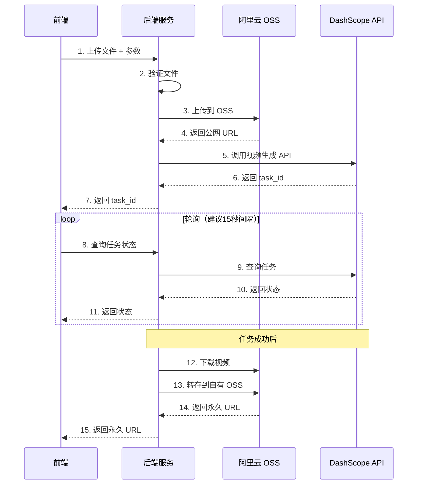

# 视频生成服务 API

基于阿里云 DashScope 通义万相的视频生成服务后端，提供图生视频、文生视频、参考生视频三种生成方式。

## 功能特性

- ✅ **图生视频 (I2V)**: 根据首帧图像 + 文本描述生成视频
- ✅ **文生视频 (T2V)**: 纯文本描述生成视频
- ✅ **参考生视频 (R2V)**: 参考输入视频中的角色形象生成新视频
- ✅ **统一查询接口**: 单一接口查询所有任务状态
- ✅ **自动文件上传**: 自动上传到 OSS 并生成公网 URL
- ✅ **视频永久存储**: 自动将生成的视频转存到自有 OSS
- ✅ **Swagger 文档**: 自动生成 API 文档
- ✅ **模块化设计**: 清晰的代码结构，易于维护

## 项目结构

```
backend/
├── app/
│   ├── main.py                      # FastAPI 应用入口
│   ├── config.py                    # 配置管理
│   ├── models/
│   │   ├── request.py              # 请求模型
│   │   └── response.py             # 响应模型
│   ├── api/
│   │   └── endpoints/
│   │       ├── video_generation.py # 视频生成端点
│   │       └── task_query.py       # 任务查询端点
│   ├── services/
│   │   ├── oss_service.py          # OSS 上传服务
│   │   ├── dashscope_service.py    # DashScope API 服务
│   │   └── video_service.py        # 业务逻辑服务
│   └── utils/
│       ├── exceptions.py           # 自定义异常
│       └── validators.py           # 文件验证器
├── .env.example                     # 环境变量模板
├── requirements.txt                 # 依赖包
└── README.md                        # 本文档
```

## 快速开始

### 1. 环境要求

- Python 3.9+
- 阿里云 OSS 账号
- 阿里云 DashScope API Key

### 2. 安装依赖

```bash
cd backend
pip install -r requirements.txt
```

### 3. 配置应用

复制 `config.yaml.example` 为 `config.yaml` 并填入实际配置：

```bash
cp config.yaml.example config.yaml
```

编辑 `config.yaml` 文件，填入以下配置：

```yaml
# DashScope API 配置
dashscope:
  api_key: your_dashscope_api_key_here
  region: singapore  # 或 beijing

# OSS 配置
oss:
  access_key_id: your_oss_access_key_id_here
  access_key_secret: your_oss_access_key_secret_here
  bucket_name: your_bucket_name_here
  endpoint: oss-cn-shanghai.aliyuncs.com

  paths:
    images: video-creator/images/
    audios: video-creator/audios/
    reference_videos: video-creator/reference-videos/
    output_videos: video-creator/output-videos/

  url_expiration: 86400

# 应用配置
app:
  port: 8000
  host: 0.0.0.0
  debug: true
  log_level: INFO
```

### 4. 运行服务

```bash
# 开发模式（自动重载）
python -m app.main

# 或使用 uvicorn 直接运行
uvicorn app.main:app --reload --host 0.0.0.0 --port 8000
```

### 5. 访问文档

服务启动后，访问以下地址查看 API 文档：

- Swagger UI: http://localhost:8000/docs
- ReDoc: http://localhost:8000/redoc

## API 接口

### 1. 图生视频 (I2V)

**POST** `/api/v1/video/i2v`

根据首帧图像和文本描述生成视频。

**表单参数：**
- `image` (必选): 图片文件（JPEG/PNG/BMP/WEBP，360-2000像素，最大10MB）
- `audio` (可选): 自定义音频文件（wav/mp3，3-30秒，最大15MB）
- `prompt` (可选): 视频描述文本，最长1500字符
- `negative_prompt` (可选): 反向提示词，最长500字符
- `model` (可选): 模型名称，默认 `wan2.6-i2v`
- `resolution` (可选): 分辨率档位，默认 `1080P`（wan2.6支持720P/1080P）
- `duration` (可选): 视频时长（秒），默认 `5`（wan2.6支持5/10/15秒）
- `prompt_extend` (可选): 是否智能改写prompt，默认 `true`
- `shot_type` (可选): 镜头类型，默认 `single`（single/multi，仅wan2.6支持）
- `audio_enable` (可选): 是否自动配音，默认 `true`
- `watermark` (可选): 是否添加水印，默认 `false`
- `seed` (可选): 随机种子，范围 [0, 2147483647]

**响应示例：**
```json
{
  "success": true,
  "message": "图生视频任务创建成功",
  "data": {
    "task_id": "0385dc79-5ff8-4d82-bcb6-xxxxxx",
    "task_status": "PENDING",
    "request_id": "4909100c-7b5a-9f92-bfe5-xxxxxx"
  }
}
```

### 2. 文生视频 (T2V)

**POST** `/api/v1/video/t2v`

仅需文本描述即可生成视频。

**表单参数：**
- `audio` (可选): 自定义音频文件（wav/mp3，3-30秒，最大15MB）
- `prompt` (必选): 视频描述文本，最长1500字符
- `negative_prompt` (可选): 反向提示词，最长500字符
- `model` (可选): 模型名称，默认 `wan2.6-t2v`
- `size` (可选): 分辨率（必须是具体数值，如1280*720），默认 `1920*1080`
- `duration` (可选): 视频时长（秒），默认 `5`（wan2.6支持5/10/15秒）
- `prompt_extend` (可选): 是否智能改写prompt，默认 `true`
- `shot_type` (可选): 镜头类型，默认 `single`（single/multi，仅wan2.6支持）
- `audio_enable` (可选): 是否自动配音，默认 `true`
- `watermark` (可选): 是否添加水印，默认 `false`
- `seed` (可选): 随机种子，范围 [0, 2147483647]

**支持的分辨率**：
- 480P: 832×480、480×832、624×624
- 720P: 1280×720、720×1280、960×960、1088×832、832×1088
- 1080P: 1920×1080、1080×1920、1440×1440、1632×1248、1248×1632

### 3. 参考生视频 (R2V)

**POST** `/api/v1/video/r2v`

根据参考视频中的角色形象和音色生成新视频，保持角色一致性。

**表单参数：**
- `reference_videos` (必选): 参考视频文件（最多3个，mp4/mov，2-30秒，单个最大100MB）
- `prompt` (必选): 视频描述文本，最长1500字符。**通过character1、character2引用参考角色**
- `negative_prompt` (可选): 反向提示词，最长500字符
- `model` (可选): 模型名称，默认 `wan2.6-r2v`
- `size` (可选): 分辨率（必须是具体数值），默认 `1920*1080`
- `duration` (可选): 视频时长（秒），默认 `5`（**仅支持5或10秒**）
- `shot_type` (可选): 镜头类型，默认 `single`（single/multi）
- `audio_enable` (可选): 是否自动配音（提取参考视频音色），默认 `true`
- `watermark` (可选): 是否添加水印，默认 `false`
- `seed` (可选): 随机种子，范围 [0, 2147483647]

**角色引用说明**：
- 第1个视频对应 `character1`，第2个对应 `character2`，以此类推
- 每个参考视频仅包含一个角色
- 示例prompt: `"character1对character2说: 你好！character2回答: 很高兴见到你！"`

### 4. 查询任务状态

**GET** `/api/v1/task/{task_id}`

查询视频生成任务的状态。

**路径参数：**
- `task_id` (必选): 任务 ID

**响应示例：**
```json
{
  "success": true,
  "message": "任务状态: SUCCEEDED",
  "data": {
    "task_id": "0385dc79-5ff8-4d82-bcb6-xxxxxx",
    "task_status": "SUCCEEDED",
    "video_url": "https://dashscope-result-sh.oss-cn-shanghai.aliyuncs.com/xxx.mp4?Expires=xxx",
    "oss_video_url": "https://your-bucket.oss-cn-shanghai.aliyuncs.com/xxx.mp4",
    "submit_time": "2025-09-25 11:07:28.590",
    "end_time": "2025-09-25 11:17:11.650",
    "orig_prompt": "一只小猫在草地上奔跑",
    "usage": {
      "duration": 10,
      "size": "1920*1080"
    }
  }
}
```

## 任务状态说明

| 状态 | 说明 | 操作 |
|------|------|------|
| `PENDING` | 排队中 | 继续轮询 |
| `RUNNING` | 处理中 | 继续轮询 |
| `SUCCEEDED` | 成功 | 获取视频 URL |
| `FAILED` | 失败 | 查看错误信息 |
| `CANCELED` | 已取消 | - |
| `UNKNOWN` | 不存在/超时 | 任务已过期 |

## 使用流程



## 前端调用示例

### JavaScript (Fetch API)

```javascript
// 1. 创建图生视频任务
async function createI2VVideo(imageFile, audioFile = null) {
  const formData = new FormData();
  formData.append('image', imageFile);

  // 可选参数
  if (audioFile) {
    formData.append('audio', audioFile);
  }
  formData.append('prompt', '一只小猫在草地上奔跑');
  formData.append('model', 'wan2.6-i2v');
  formData.append('resolution', '1080P');
  formData.append('duration', 10);
  formData.append('shot_type', 'multi');  // 多镜头叙事
  formData.append('audio_enable', true);  // 自动配音（默认为true）
  formData.append('prompt_extend', true); // 智能改写prompt（默认为true）

  const response = await fetch('http://localhost:8000/api/v1/video/i2v', {
    method: 'POST',
    body: formData
  });

  const result = await response.json();
  if (!result.success) {
    throw new Error(result.message);
  }
  return result.data.task_id;
}

// 2. 创建文生视频任务
async function createT2VVideo(audioFile = null) {
  const formData = new FormData();

  if (audioFile) {
    formData.append('audio', audioFile);
  }
  formData.append('prompt', '一只小猫在月光下的草地上奔跑，背景是星空');
  formData.append('model', 'wan2.6-t2v');
  formData.append('size', '1280*720');
  formData.append('duration', 10);
  formData.append('shot_type', 'multi');
  formData.append('audio_enable', true);

  const response = await fetch('http://localhost:8000/api/v1/video/t2v', {
    method: 'POST',
    body: formData
  });

  const result = await response.json();
  if (!result.success) {
    throw new Error(result.message);
  }
  return result.data.task_id;
}

// 3. 创建参考生视频任务
async function createR2VVideo(videoFiles) {
  if (videoFiles.length > 3) {
    throw new Error('最多支持3个参考视频');
  }

  const formData = new FormData();

  // 添加参考视频（顺序对应character1、character2...）
  videoFiles.forEach(file => {
    formData.append('reference_videos', file);
  });

  // 使用character1、character2引用参考角色
  formData.append('prompt', 'character1对character2说: 你好！character2回答: 很高兴见到你！');
  formData.append('model', 'wan2.6-r2v');
  formData.append('size', '1280*720');
  formData.append('duration', 10);
  formData.append('shot_type', 'multi');
  formData.append('audio_enable', true);  // 提取参考视频音色

  const response = await fetch('http://localhost:8000/api/v1/video/r2v', {
    method: 'POST',
    body: formData
  });

  const result = await response.json();
  if (!result.success) {
    throw new Error(result.message);
  }
  return result.data.task_id;
}

// 4. 轮询查询任务状态
async function pollTaskStatus(taskId) {
  const response = await fetch(`http://localhost:8000/api/v1/task/${taskId}`);
  const result = await response.json();

  if (!result.success) {
    throw new Error(result.message);
  }

  const { task_status, oss_video_url, error_message } = result.data;

  if (task_status === 'SUCCEEDED') {
    console.log('视频生成成功:', oss_video_url);
    return result.data;
  } else if (task_status === 'FAILED') {
    console.error('视频生成失败:', error_message);
    throw new Error(error_message);
  } else {
    // 继续轮询（PENDING 或 RUNNING）
    console.log(`任务状态: ${task_status}，15秒后重试...`);
    await new Promise(resolve => setTimeout(resolve, 15000)); // 等待15秒
    return pollTaskStatus(taskId);
  }
}

// 使用示例
async function generateVideo() {
  try {
    // 选择要使用的接口
    const taskId = await createI2VVideo(imageFile);
    // const taskId = await createT2VVideo();
    // const taskId = await createR2VVideo([video1File, video2File]);

    console.log('任务已创建:', taskId);
    const result = await pollTaskStatus(taskId);
    console.log('视频生成完成:', result);
  } catch (error) {
    console.error('错误:', error.message);
  }
}
```

## 注意事项

1. **文件大小限制**
   - 图片：最大 10MB
   - 音频：最大 15MB
   - 参考视频：单个最大 100MB

2. **文件格式要求**
   - 图片：JPEG, JPG, PNG（不支持透明通道）, BMP, WEBP
   - 音频：WAV, MP3
   - 参考视频：MP4, MOV

3. **图片分辨率要求**
   - 宽度和高度：均在 [360, 2000] 像素范围内

4. **音频时长要求**
   - 时长：3～30秒
   - 超限处理：音频长度超过duration时自动截取，不足时超出部分为无声视频

5. **任务有效期**
   - task_id 有效期：24 小时
   - 临时视频 URL 有效期：24 小时
   - 建议立即转存到永久存储

6. **参数优先级**
   - **音频**: `audio_url` > `audio` 参数
   - **镜头类型**: `shot_type` > prompt中的描述
   - **I2V/T2V**: `shot_type` 仅在 `prompt_extend=true` 时生效

7. **轮询建议**
   - 间隔：15 秒
   - 平均耗时：1-5 分钟
   - 避免频繁请求

8. **地域配置**
   - 北京和新加坡的 API Key 不同，不可混用
   - 确保 `DASHSCOPE_REGION` 配置正确

9. **R2V 特殊说明**
   - duration 只支持 5 或 10 秒
   - 使用 `character1`、`character2` 等引用参考视频中的角色
   - 参考视频顺序决定角色编号
   - 每个参考视频仅包含一个角色

10. **默认参数值**
    - `audio_enable`: `true`（自动配音）
    - `shot_type`: `single`（单镜头）
    - `prompt_extend`: `true`（智能改写）
    - `watermark`: `false`（不添加水印）

## 故障排查

### 1. OSS 上传失败

**错误**: `OSSUploadException: OSS客户端初始化失败`

**解决**:
- 检查 OSS Access Key 是否正确
- 检查 OSS Bucket 是否存在
- 检查 OSS Endpoint 配置是否正确

### 2. DashScope API 调用失败

**错误**: `DashScopeAPIException: API响应格式错误`

**解决**:
- 检查 DashScope API Key 是否正确
- 检查 `DASHSCOPE_REGION` 是否与 API Key 匹配
- 查看详细错误信息

### 3. 文件验证失败

**错误**: `FileValidationException: 图片分辨率不符合要求`

**解决**:
- 确保图片分辨率在 360-2000 像素之间
- 确保文件格式符合要求
- 检查文件大小是否超限

## 开发建议

1. **生产环境部署**
   - 设置 `DEBUG=False`
   - 配置具体的 CORS 允许域名
   - 使用 Gunicorn + Uvicorn 部署
   - 配置 HTTPS

2. **性能优化**
   - 使用连接池
   - 启用 HTTP/2
   - 配置 CDN 加速 OSS 访问

3. **监控与日志**
   - 配置日志收集
   - 监控 API 调用频率
   - 设置告警规则

## License

MIT
